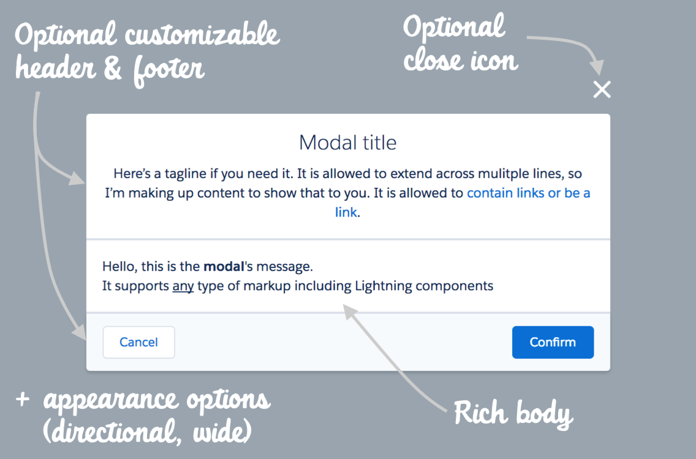

# Salesforce Lightning Modal Component (Deprecated)

**WARNING:** this component is deprectated. 
It is replaced by the following base components:
- [lightning:notificationsLibrary](https://developer.salesforce.com/docs/component-library/bundle/lightning:notificationsLibrary/documentation) for simple text notices.
- [lightning:overlayLibrary](https://developer.salesforce.com/docs/component-library/bundle/lightning:overlayLibrary/documentation) for fully customizable modal dialogs

## About
This is a generic & customizable modal dialog component built using Salesforce Lightning and [SLDS](https://www.lightningdesignsystem.com/) style.
It does not rely on third party libraries.
It features all of the options of the original [SLDS modal](https://www.lightningdesignsystem.com/components/modals/).

<b>Features</b>

The Lightning Modal component provides the following features:
- rich body that supports any Lightning components
- optional header block with a title and an optional tagline
- optional footer block that supports any Lightning components
- rendering options: wide modal, close icon, directional buttons
- a shorthand method to dynamically create a simple alert modal

## Install
Install the Lightning Modal component as a managed package by clicking on this button:

## Documentation
Component is documented using the Aura documentation.
You can access it from this URL (replace the domain):
https://<b>&lt;YOUR_DOMAIN&gt;</b>.lightning.force.com/auradocs/reference.app#reference?descriptor=ui_modal:modal&defType=component

## Sample application
Check out the [sample application](https://github.com/pozil/sfdc-ui-modal-sample).
